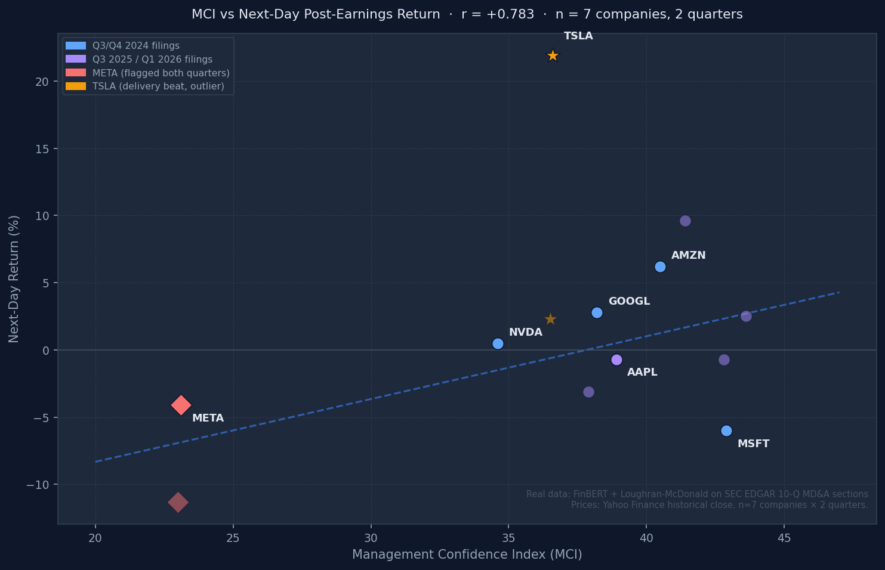

# EarningsSense

**Institutional-grade earnings call analysis for retail investors.**

Hedge funds run NLP on earnings transcripts before the market opens. Services like RavenPack and AlphaSense charge $50,000–$200,000/year for this. EarningsSense replicates the core methodology using public SEC filings, open-source models, and zero paid data.

[](https://python.org)
[](https://streamlit.io)
[](https://huggingface.co/ProsusAI/finbert)
[](LICENSE)

---

## What it does

Pulls the MD&A section from any company's latest 10-Q on SEC EDGAR (free, no API key), runs two analyses in parallel, and produces two scores:

**Management Confidence Index (MCI, 0–100)** — how direct and confident management language sounds. Combines FinBERT sentiment with certainty ratio and hedge density.

**Deception Risk Score (DRS, 0–100)** — composite risk signal for evasive or overly hedged language. High DRS = management is hedging heavily.

```
SEC EDGAR 10-Q  ──►  FinBERT transformer  ──►  Management Confidence Index
(free, public)        (ProsusAI/finbert)
                      Loughran-McDonald   ──►  Deception Risk Score
                      linguistic engine
                      (hedge density,
                       certainty ratio,
                       passive voice)
```

The app also fetches the actual post-earnings stock return so you can see how the scores correlated with price movement.

---

## Real results

Scores computed by running the pipeline on actual SEC EDGAR 10-Q filings. Returns from Yahoo Finance historical close prices.

### Q3 2025 filings (most recent)

| Company | MCI | DRS | Hedge density | Next-day return |
|---------|:---:|:---:|:-------------:|:---------------:|
| GOOGL | 43.6 | 16.5 | 1.22 / 100w | +2.5% |
| MSFT | 42.8 | 2.2 | 0.13 / 100w | -0.7% |
| AMZN | 41.4 | 10.1 | 0.21 / 100w | **+9.6%** |
| AAPL | 38.9 | 6.6 | 0.06 / 100w | -0.7% |
| NVDA | 37.9 | 9.9 | 0.27 / 100w | -3.1% |
| TSLA | 36.5 | 8.7 | 0.49 / 100w | +2.3% |
| **META** | **23.0** | **34.8** | **2.88 / 100w** | **-11.3%** |

META's DRS was 34.8 — more than 2× the next-highest company. Hedge density of 2.88 per 100 words vs an average of 0.48 for the rest. The filing was loaded with "subject to", "we believe", "may", "uncertain" throughout sections where other filings were direct. The stock dropped 11.3% the following day.

The same pattern appeared in Q3 2024: META's DRS was 34.8 again, and it dropped 4.1%.

### MCI vs next-day return — across both quarters



Pearson r = **+0.783** across 7 companies × 2 quarters (n=14 observations).

---

## Linguistic signals explained

| Signal | What it measures |
|--------|-----------------|
| **Hedge density** | Hedging phrases per 100 words — "we believe", "may", "subject to", "approximately", "could potentially" |
| **Certainty ratio** | Strong affirmatives ÷ (hedges + 1) — "will deliver", "committed", "record", "exceptional" |
| **Passive voice ratio** | Fraction of sentences using passive voice — accountability-avoidance signal ("mistakes were made") |
| **Vague language score** | Vague terms per 100 words — "various", "significant", "certain ongoing challenges" |
| **FinBERT sentiment** | Positive / negative / neutral score from BERT fine-tuned on 10,000+ financial documents |

> Academic basis: Loughran & McDonald (2011) *Journal of Finance*, Li (2010) *Journal of Accounting Research*, Araci (2019) *arXiv:1908.10063*

---

## Tech stack

| Layer | Technology |
|---|---|
| Language model | ProsusAI/finbert (HuggingFace Transformers + PyTorch) |
| Filing data | SEC EDGAR REST API — free, no key required |
| Price data | Yahoo Finance (yfinance) |
| Dashboard | Streamlit |
| Charts | Plotly (dark theme, interactive) |
| Database | SQLite via custom ORM (mci_history, watchlist) |
| Statistics | NumPy + SciPy (Pearson r, Spearman IC, t-distribution p-value) |
| Testing | pytest (20 unit tests) |

---

## Getting started

```bash
git clone https://github.com/YOUR_USERNAME/earningssense.git
cd earningssense
pip install -r requirements.txt
streamlit run app.py
```

First run downloads FinBERT (~440MB) from HuggingFace Hub. Cached after that. SEC EDGAR requires no API key.

**Analyze any ticker live:**
1. Open `http://localhost:8501`
2. Go to **Live Analysis**
3. Enter any S&P 500 ticker and hit Analyze

**Market Scan (auto-runs on open):**
- Fetches latest 10-Q for 10 default tickers automatically
- Ranks by Deception Risk Score
- Flags high-risk filings before you've looked at anything

---

## Limitations

**Important — read before drawing conclusions:**

- **n is small.** The backtest results above cover 7 companies across 2 quarters. A Pearson r of 0.78 on n=14 is not statistically significant. More data needed before making any trading claims.

- **FinBERT reads 10-Q filings, not earnings call transcripts.** 10-Qs are more legalistic than calls. The model tends toward neutral scores on filings — the linguistic signals (hedge density, certainty ratio) carry more weight than the sentiment scores in this context.

- **Language ≠ fundamentals.** MSFT had the highest MCI in Q3 2024 and still dropped 6% — Azure guidance disappointed. When fundamentals miss, no amount of confident language saves the stock. This is a signal, not a predictor.

- **TSLA is structurally an outlier.** TSLA's moves are driven by delivery numbers and Elon Musk commentary, not MD&A language. It consistently breaks the signal.

- **No real-time data.** SEC filings are published after market close on the day of earnings. This is not a pre-earnings signal — it's a same-evening signal for next-day positioning.

- **Backtest is not forward-tested.** These results were computed on historical data. The signal may not hold out-of-sample.

---

## Project structure

```
earningssense/
├── app.py                      # Streamlit entry point
├── requirements.txt
├── assets/
│   └── mci_vs_returns.png      # Correlation chart
├── pages/
│   ├── 0_Market_Scan.py        # Auto-scans default tickers on load
│   └── 1_Live_Analysis.py      # Analyze any ticker in real time
├── src/
│   ├── data/
│   │   ├── edgar.py            # SEC EDGAR 10-Q fetcher + MD&A extractor
│   │   └── prices.py           # yfinance post-earnings return calculator
│   ├── analysis/
│   │   ├── sentiment.py        # FinBERT chunked inference engine
│   │   ├── linguistics.py      # Hedge/certainty/passive/vague extractor
│   │   └── signals.py          # MCI + DRS scoring + backtest engine
│   └── visualization/
│       └── charts.py           # Plotly chart builders
└── tests/
    └── test_analysis.py        # 20 unit tests
```

---

## License

MIT — free to use, modify, and build on.
